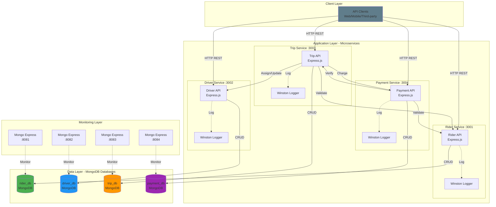
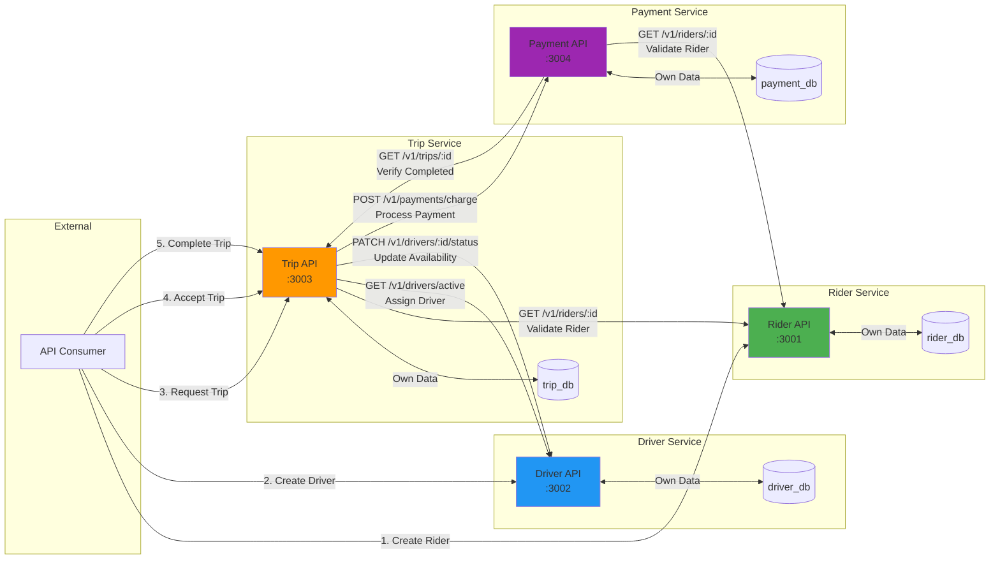
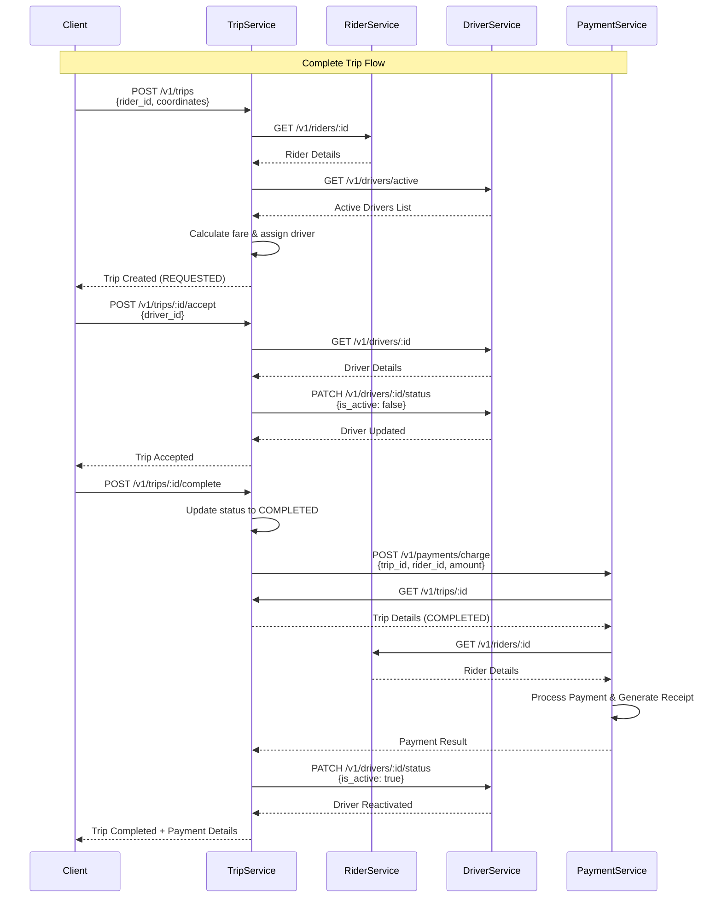
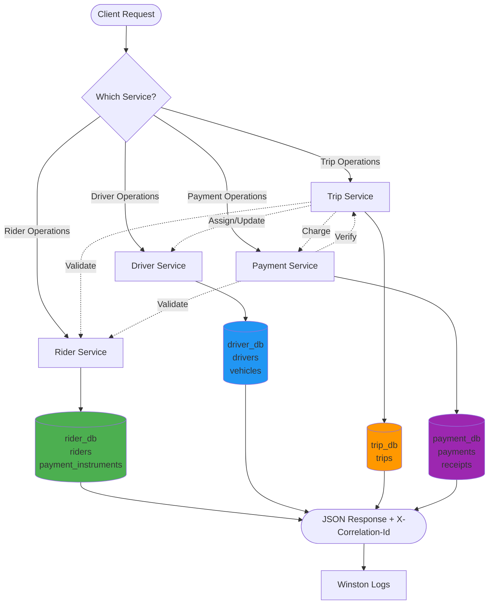
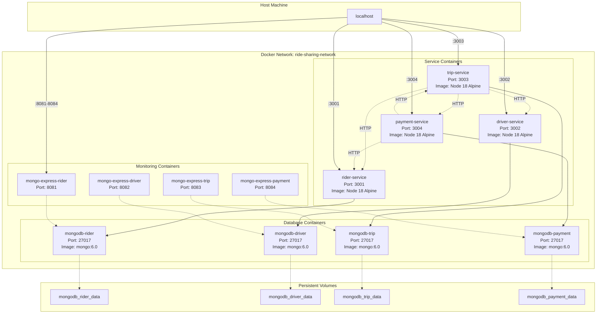

## Ride-Hailing Microservices Project

This repository contains a small ride-hailing microservices example with the following services:

- `rider-service` (port 3001)
- `driver-service` (port 3002)
- `trip-service` (port 3003)
- `payment-service` (port 3004)

Each service is a Node.js/Express app that uses MongoDB for persistence. The project includes a `docker-compose.yml` that spins up one MongoDB instance per service and each Node service.

## High-level architecture

- Each service exposes a REST API under `/v1/<resource>` (e.g. `/v1/riders`, `/v1/drivers`, `/v1/trips`, `/v1/payments`).
- Services communicate via HTTP (internal service-to-service calls implemented with `axios`).
- Each service has its own MongoDB database (separate containers in docker-compose): `mongodb-rider`, `mongodb-driver`, `mongodb-trip`, `mongodb-payment`.
- All services implement a lightweight request correlation header `X-Correlation-Id` and structured logs with Winston.

## Architecture Diagrams

### System Architecture Overview



### Service Intercommunication Flow



### Trip Lifecycle Sequence Diagram



### Data Flow Architecture



### Deployment Architecture (Docker Compose)



### Key Architecture Principles

1. **Database per Service**: Each microservice has its own MongoDB instance
2. **Service Independence**: Services can be deployed, scaled, and updated independently
3. **Loose Coupling**: Services communicate via REST APIs (HTTP)
4. **Eventual Consistency**: No distributed transactions; services validate via API calls
5. **Correlation Tracking**: X-Correlation-Id header propagates through all service calls
6. **Health Monitoring**: Each service exposes /health endpoint
7. **Containerization**: All services and databases run in Docker containers
8. **Idempotency**: Payment service supports idempotent operations

## Common patterns & cross-cutting concerns

- Health endpoint: `GET /health` returns service status.
- Logging: each service uses Winston and stores logs in a `logs/` folder inside the container.
- DB initialization: each service has `config/database.js` that initializes indexes and exposes `init()`, `getDb()`, `getClient()`.
- Correlation ID: incoming requests get `X-Correlation-Id` (generated if missing) and added to logs and outbound requests.
- Docker: each service includes a `Dockerfile` (Node 18 Alpine, installs production deps and exposes service port).

## Service details (endpoints, ports, env variables)

Driver Service
- Location: `driver-service/driver-service`
- Port: 3002 (default)
- Base route: `/v1/drivers`
- Health: `GET /health`
- Endpoints:
  - `GET /v1/drivers` — list drivers
  - `GET /v1/drivers/active` — list active drivers
  - `GET /v1/drivers/:id` — get driver by id
  - `POST /v1/drivers` — create driver (payload: name, email, license_number, optional vehicle data)
  - `PUT /v1/drivers/:id` — update driver
  - `PATCH /v1/drivers/:id/status` — update driver active status (body: { is_active: boolean })
  - `DELETE /v1/drivers/:id` — delete driver
- Env variables (used): `PORT`, `DB_HOST`, `DB_PORT`, `DB_NAME` (see docker-compose which sets MONGO_URL for containers)

Rider Service
- Location: `rider-service/rider-service`
- Port: 3001 (default)
- Base route: `/v1/riders`
- Health: `GET /health`
- Endpoints:
  - `GET /v1/riders` — list riders
  - `GET /v1/riders/:id` — get rider by id
  - `POST /v1/riders` — create rider (payload: name, email, phone)
  - `PUT /v1/riders/:id` — update rider
  - `DELETE /v1/riders/:id` — delete rider
- Env variables: same pattern as other services (`PORT`, `DB_HOST`, ...)

Trip Service
- Location: `trip-service/trip-service`
- Port: 3003 (default)
- Base route: `/v1/trips`
- Health: `GET /health`
- Endpoints:
  - `GET /v1/trips` — list trips
  - `GET /v1/trips/:id` — get trip by id
  - `POST /v1/trips` — create trip (payload requires rider_id and pickup/drop coordinates)
  - `POST /v1/trips/:id/accept` — accept trip (body: { driver_id })
  - `POST /v1/trips/:id/complete` — complete trip (triggers payment flow)
  - `POST /v1/trips/:id/cancel` — cancel trip
  - `PUT /v1/trips/:id` — update certain trip fields
- Integration: calls `driver-service`, `rider-service`, and `payment-service` using `services` config + `services/externalService.js`.

Payment Service
- Location: `payment-service/payment-service`
- Port: 3004 (default)
- Base route: `/v1/payments`
- Health: `GET /health`
- Endpoints:
  - `GET /v1/payments` — list payments
  - `GET /v1/payments/:id` — get payment by id
  - `POST /v1/payments/charge` — process a payment (payload: trip_id, rider_id, amount, currency, idempotency_key)
  - `POST /v1/payments/:id/refund` — refund a payment
  - `GET /v1/payments/trip/:tripId` — payments for a trip
- Important behaviors:
  - Idempotency: `chargePayment` supports `idempotency_key` to prevent duplicate charges (unique index on `idempotency_key`).
  - External calls: payment verifies trip via Trip Service and rider via Rider Service before charging.

## Docker & docker-compose

- Use the repo root `docker-compose.yml`. It defines separate MongoDB containers and Node services. Each Node service's container exposes the port mapped to the same host port (3001-3004).
- Example: `driver-service` in compose builds from `./driver-service` and maps `3002:3002`.

To start everything with Docker (recommended for a full environment):

1. From the repository root:

```powershell
docker-compose up --build
```

2. Health endpoints:

- Rider: http://localhost:3001/health
- Driver: http://localhost:3002/health
- Trip: http://localhost:3003/health
- Payment: http://localhost:3004/health

## How to run a single service locally (example: rider)

- cd into the service folder, install deps, and start:

```powershell
cd rider-service/rider-service
npm install
npm run start
```

Notes: each service expects a MongoDB available. You can either run the corresponding mongo container from docker-compose (recommended) or point the service to an external MongoDB by setting env vars.

## Observations, assumptions & next steps

- The services are intentionally small and synchronous (HTTP-based) for clarity. In production you may want to:
  - Add authentication/authorization.
  - Use service discovery or a gateway (instead of hard-coded service URLs in `config/services.js`).
  - Add retries/backoff and circuit breakers for inter-service HTTP calls.
  - Add proper API input validation and typed request/response shapes.
  - Add tests (unit/integration) and CI.

## Where to find code

- `*/index.js` — app bootstrap
- `*/routes/*` — route definitions
- `*/controllers/*` — implementation of endpoints
- `*/config/*` — DB and service URLs
- `*/services/*` — external service calls (used by trip/payment services)

---

If you want, I can: add full README.md files in each service folder, produce a Postman collection for the APIs, or generate OpenAPI specs for each service. Which would you prefer next?
