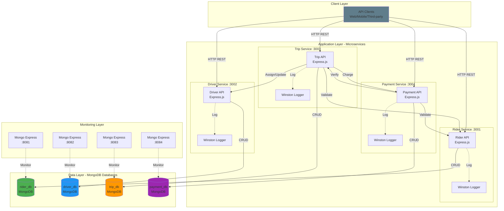
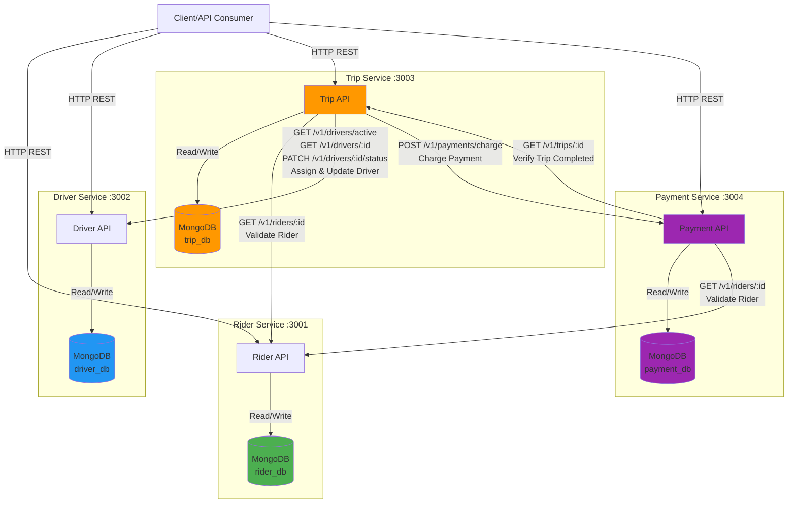
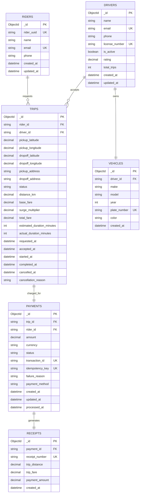
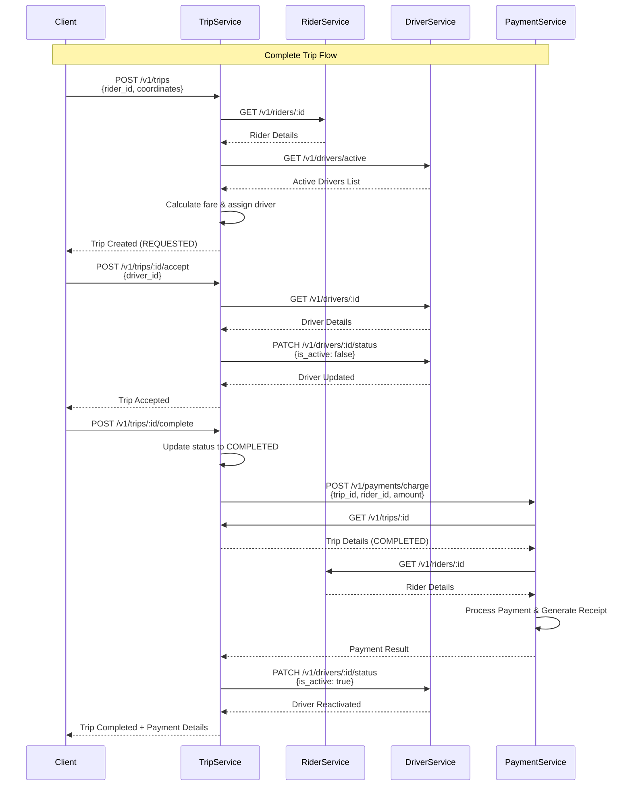
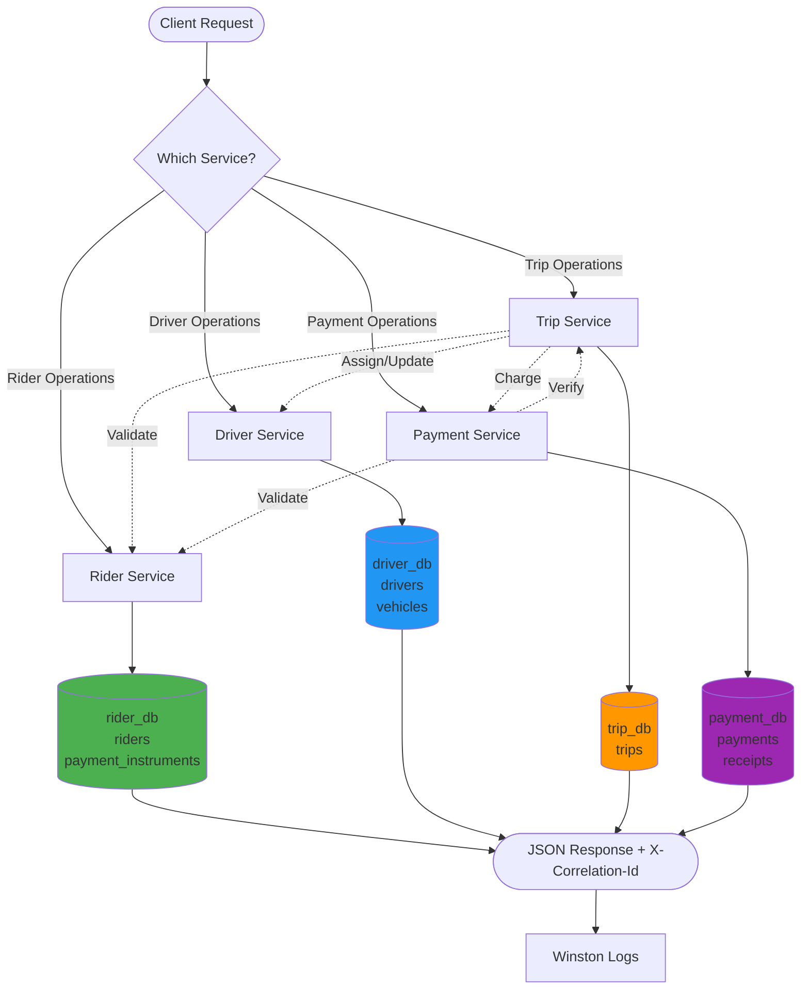
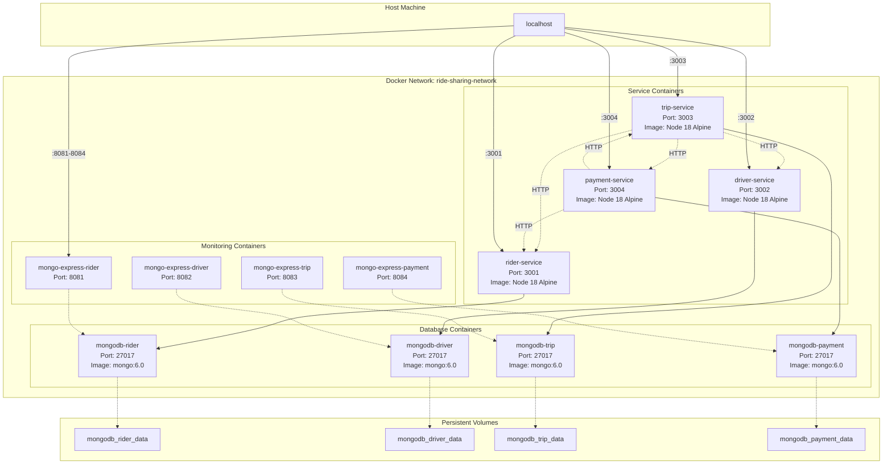

# Ride-Hailing Microservices Platform

A microservices-based ride-hailing platform built with Node.js, Express, and MongoDB. This project demonstrates a scalable architecture with four independent services handling riders, drivers, trips, and payments.

## Overview

The platform consists of four microservices:

- **Rider Service** (Port 3001) - Manages rider profiles
- **Driver Service** (Port 3002) - Manages drivers and their vehicles
- **Trip Service** (Port 3003) - Handles trip lifecycle and orchestration
- **Payment Service** (Port 3004) - Processes payments and generates receipts

Each service has its own MongoDB database and communicates with other services via HTTP REST APIs.

## Architecture

- **Service Communication**: HTTP-based REST APIs with correlation ID tracing
- **Database**: Separate MongoDB instance per service (database-per-service pattern)
- **Logging**: Structured logging with Winston, includes correlation IDs
- **Containerization**: Docker containers for each service and database
- **Orchestration**: Docker Compose for local development

### Key Features

- ✅ Microservices architecture with clear service boundaries
- ✅ Request correlation tracking with `X-Correlation-Id` header
- ✅ Health check endpoints for all services
- ✅ Idempotent payment processing
- ✅ Service-to-service communication
- ✅ MongoDB indexes for performance
- ✅ Structured logging to files and console

### Architecture Diagrams

#### System Architecture Overview



#### Service Intercommunication Diagram



### Entity Relationship Diagram



**Legend**:
- `PK` = Primary Key
- `FK` = Foreign Key (string reference, application-level)
- `UK` = Unique Key
- Solid lines show relationships between entities
- Dashed lines would show optional relationships (all shown are required once created)

#### Trip Lifecycle Sequence Diagram



#### Data Flow Architecture



#### Deployment Architecture (Docker Compose)



### Key Architecture Principles

1. **Database per Service**: Each microservice has its own MongoDB instance
2. **Service Independence**: Services can be deployed, scaled, and updated independently
3. **Loose Coupling**: Services communicate via REST APIs (HTTP)
4. **Eventual Consistency**: No distributed transactions; services validate via API calls
5. **Correlation Tracking**: X-Correlation-Id header propagates through all service calls
6. **Health Monitoring**: Each service exposes /health endpoint
7. **Containerization**: All services and databases run in Docker containers
8. **Idempotency**: Payment service supports idempotent operations

## Quick Start

### Prerequisites

- Docker & Docker Compose (recommended)
- OR Node.js 18+ and MongoDB 6.0+ (for local development)

### Run with Docker Compose (Recommended)

From the repository root:

```powershell
docker-compose up --build
```

This will start all services and their MongoDB instances. Services will be available at:

- Rider Service: http://localhost:3001
- Driver Service: http://localhost:3002
- Trip Service: http://localhost:3003
- Payment Service: http://localhost:3004

### Verify Services are Running

```powershell
# Check all health endpoints
curl http://localhost:3001/health
curl http://localhost:3002/health
curl http://localhost:3003/health
curl http://localhost:3004/health
```

### Stop Services

```powershell
docker-compose down
```

To also remove volumes (databases):

```powershell
docker-compose down -v
```

## Service Details

### Rider Service

**Port**: 3001  
**Location**: `rider-service/rider-service`  
**Database**: `rider_db` (MongoDB container: `mongodb-rider`)

**Endpoints**:
- `GET /health` - Health check
- `GET /v1/riders` - List all riders
- `GET /v1/riders/:id` - Get rider by ID
- `POST /v1/riders` - Create new rider
  - Body: `{ name, email, phone }`
- `PUT /v1/riders/:id` - Update rider
- `DELETE /v1/riders/:id` - Delete rider

**Run Locally**:
```powershell
cd rider-service/rider-service
npm install
$env:DB_HOST = 'localhost'
$env:DB_PORT = '27017'
$env:DB_NAME = 'rider_db'
$env:PORT = '3001'
npm run start
```

---

### Driver Service

**Port**: 3002  
**Location**: `driver-service/driver-service`  
**Database**: `driver_db` (MongoDB container: `mongodb-driver`)

**Endpoints**:
- `GET /health` - Health check
- `GET /v1/drivers` - List all drivers with vehicles
- `GET /v1/drivers/active` - List active drivers only
- `GET /v1/drivers/:id` - Get driver by ID
- `POST /v1/drivers` - Create new driver
  - Body: `{ name, email, license_number, phone?, make?, model?, plate_number?, year?, color? }`
- `PUT /v1/drivers/:id` - Update driver info
- `PATCH /v1/drivers/:id/status` - Update driver active status
  - Body: `{ is_active: boolean }`
- `DELETE /v1/drivers/:id` - Delete driver and vehicle

**Run Locally**:
```powershell
cd driver-service/driver-service
npm install
$env:DB_HOST = 'localhost'
$env:DB_PORT = '27017'
$env:DB_NAME = 'driver_db'
$env:PORT = '3002'
npm run start
```

---

### Trip Service

**Port**: 3003  
**Location**: `trip-service/trip-service`  
**Database**: `trip_db` (MongoDB container: `mongodb-trip`)

**Endpoints**:
- `GET /health` - Health check
- `GET /v1/trips` - List all trips (last 100)
- `GET /v1/trips/:id` - Get trip by ID
- `POST /v1/trips` - Create new trip
  - Body: `{ rider_id, pickup_latitude, pickup_longitude, dropoff_latitude, dropoff_longitude, pickup_address?, dropoff_address? }`
- `POST /v1/trips/:id/accept` - Accept trip (assigns driver)
  - Body: `{ driver_id }`
- `POST /v1/trips/:id/complete` - Complete trip (triggers payment)
- `POST /v1/trips/:id/cancel` - Cancel trip
  - Body: `{ cancellation_reason? }`
- `PUT /v1/trips/:id` - Update trip details

**Integration**:
- Validates riders and drivers via external service calls
- Automatically assigns active drivers on trip creation
- Triggers payment processing on trip completion
- Updates driver availability status

**Run Locally**:
```powershell
cd trip-service/trip-service
npm install
$env:DB_HOST = 'localhost'
$env:DB_PORT = '27017'
$env:DB_NAME = 'trip_db'
$env:PORT = '3003'
$env:DRIVER_SERVICE_URL = 'http://localhost:3002'
$env:RIDER_SERVICE_URL = 'http://localhost:3001'
$env:PAYMENT_SERVICE_URL = 'http://localhost:3004'
npm run start
```

---

### Payment Service

**Port**: 3004  
**Location**: `payment-service/payment-service`  
**Database**: `payment_db` (MongoDB container: `mongodb-payment`)

**Endpoints**:
- `GET /health` - Health check
- `GET /v1/payments` - List all payments (last 100)
- `GET /v1/payments/:id` - Get payment by ID
- `GET /v1/payments/trip/:tripId` - Get payments for a trip
- `POST /v1/payments/charge` - Process payment
  - Body: `{ trip_id, rider_id, amount, currency?, idempotency_key? }`
- `POST /v1/payments/:id/refund` - Refund payment
  - Body: `{ reason? }`

**Features**:
- **Idempotency**: Supports `idempotency_key` to prevent duplicate charges
- **Validation**: Verifies trip is completed and rider exists before charging
- **Receipt Generation**: Automatically creates receipts for successful payments
- **Simulated Gateway**: 95% success rate for testing

**Run Locally**:
```powershell
cd payment-service/payment-service
npm install
$env:DB_HOST = 'localhost'
$env:DB_PORT = '27017'
$env:DB_NAME = 'payment_db'
$env:PORT = '3004'
$env:TRIP_SERVICE_URL = 'http://localhost:3003'
$env:RIDER_SERVICE_URL = 'http://localhost:3001'
npm run start
```

---

## Example API Flow

### Complete Trip Flow (End-to-End)

```powershell
# 1. Create a rider
curl -X POST http://localhost:3001/v1/riders -H "Content-Type: application/json" -d '{\"name\": \"John Doe\", \"email\": \"john@example.com\", \"phone\": \"+1234567890\"}'

# 2. Create a driver
curl -X POST http://localhost:3002/v1/drivers -H "Content-Type: application/json" -d '{\"name\": \"Jane Smith\", \"email\": \"jane@example.com\", \"license_number\": \"DL123456\", \"make\": \"Toyota\", \"model\": \"Camry\", \"plate_number\": \"ABC123\"}'

# 3. Request a trip
curl -X POST http://localhost:3003/v1/trips -H "Content-Type: application/json" -d '{\"rider_id\": \"<rider_id>\", \"pickup_latitude\": 37.7749, \"pickup_longitude\": -122.4194, \"dropoff_latitude\": 37.8044, \"dropoff_longitude\": -122.2712}'

# 4. Accept the trip
curl -X POST http://localhost:3003/v1/trips/<trip_id>/accept -H "Content-Type: application/json" -d '{\"driver_id\": \"<driver_id>\"}'

# 5. Complete the trip (automatically triggers payment)
curl -X POST http://localhost:3003/v1/trips/<trip_id>/complete
```

## Environment Variables

Each service supports the following environment variables:

| Variable | Default | Description |
|----------|---------|-------------|
| `PORT` | Service-specific (3001-3004) | Port the service listens on |
| `DB_HOST` | `mongodb-<service>` | MongoDB host |
| `DB_PORT` | `27017` | MongoDB port |
| `DB_NAME` | `<service>_db` | MongoDB database name |

Additional variables for services with dependencies:

**Trip Service**:
- `DRIVER_SERVICE_URL` - Default: `http://driver-service:3002`
- `RIDER_SERVICE_URL` - Default: `http://rider-service:3001`
- `PAYMENT_SERVICE_URL` - Default: `http://payment-service:3004`

**Payment Service**:
- `TRIP_SERVICE_URL` - Default: `http://trip-service:3003`
- `RIDER_SERVICE_URL` - Default: `http://rider-service:3001`

## Project Structure

```
.
├── docker-compose.yml              # Orchestrates all services
├── README.md                       # This file (complete documentation)
├── driver-service/
│   └── driver-service/
│       ├── index.js
│       ├── package.json
│       ├── Dockerfile
│       ├── config/
│       │   └── database.js
│       ├── controllers/
│       │   └── driverController.js
│       └── routes/
│           └── driverRoutes.js
├── rider-service/
│   └── rider-service/
│       ├── index.js
│       ├── package.json
│       ├── Dockerfile
│       ├── config/
│       │   └── database.js
│       ├── controllers/
│       │   └── riderController.js
│       └── routes/
│           └── riderRoutes.js
├── trip-service/
│   └── trip-service/
│       ├── index.js
│       ├── package.json
│       ├── Dockerfile
│       ├── config/
│       │   ├── database.js
│       │   └── services.js
│       ├── controllers/
│       │   └── tripController.js
│       ├── routes/
│       │   └── tripRoutes.js
│       └── services/
│           └── externalService.js
└── payment-service/
    └── payment-service/
        ├── index.js
        ├── package.json
        ├── Dockerfile
        ├── config/
        │   ├── database.js
        │   └── services.js
        ├── controllers/
        │   └── paymentController.js
        ├── routes/
        │   └── paymentRoutes.js
        └── services/
            └── externalService.js
```

## Database Design & Patterns

### Architecture Pattern

This project follows the **Database-per-Service** pattern, a core microservices principle where each service owns its data and database. This provides:

- **Data Isolation**: Services cannot directly access other services' databases
- **Independent Scaling**: Each database can be scaled independently
- **Technology Flexibility**: Different services could use different database technologies
- **Fault Isolation**: Database issues in one service don't affect others

### Database Schema & Collections

#### Rider Service Database (`rider_db`)

**Collection: `riders`**
```javascript
{
  _id: ObjectId,
  rider_uuid: String,           // Unique UUID for stable external references
  name: String,                 // Required
  email: String,                // Required, unique index
  phone: String,                // Optional
  created_at: Date,
  updated_at: Date
}
```

**Indexes**:
- `email` (unique) - Fast lookup and prevents duplicates
- `rider_uuid` (unique, sparse) - Stable external ID for cross-service references
- `_id` - Default MongoDB index

**Collection: `payment_instruments`** (Schema defined, not yet implemented)
- Placeholder for future payment method storage
- Would link to `rider_id`

---

#### Driver Service Database (`driver_db`)

**Collection: `drivers`**
```javascript
{
  _id: ObjectId,
  name: String,                 // Required
  email: String,                // Required, unique index
  phone: String,                // Optional
  license_number: String,       // Required, unique index
  is_active: Boolean,           // Driver availability status
  rating: Number,               // Decimal, default 0.00
  total_trips: Number,          // Counter, default 0
  created_at: Date,
  updated_at: Date
}
```

**Indexes**:
- `email` (unique) - Prevents duplicate driver emails
- `license_number` (unique) - Ensures unique licenses
- `is_active` - Fast filtering of available drivers
- `_id` - Default MongoDB index

**Collection: `vehicles`**
```javascript
{
  _id: ObjectId,
  driver_id: String,            // References driver._id as string
  make: String,                 // Required (e.g., "Toyota")
  model: String,                // Required (e.g., "Camry")
  year: Number,                 // Optional
  plate_number: String,         // Required, unique index
  color: String,                // Optional
  created_at: Date
}
```

**Indexes**:
- `driver_id` - Fast lookup of vehicles by driver
- `plate_number` (unique) - Ensures unique license plates
- `_id` - Default MongoDB index

**Relationship**: One-to-one relationship between drivers and vehicles using `driver_id` as a foreign key (enforced at application level, not database level).

---

#### Trip Service Database (`trip_db`)

**Collection: `trips`**
```javascript
{
  _id: ObjectId,
  rider_id: String,             // References rider._id as string
  driver_id: String,            // References driver._id as string, nullable
  pickup_latitude: Number,      // Required
  pickup_longitude: Number,     // Required
  dropoff_latitude: Number,     // Required
  dropoff_longitude: Number,    // Required
  pickup_address: String,       // Optional
  dropoff_address: String,      // Optional
  status: String,               // REQUESTED, ACCEPTED, ONGOING, COMPLETED, CANCELLED
  distance_km: Number,          // Calculated distance
  base_fare: Number,            // Base fare amount
  surge_multiplier: Number,     // Surge pricing factor
  total_fare: Number,           // Final calculated fare
  estimated_duration_minutes: Number,  // Optional
  actual_duration_minutes: Number,     // Optional
  requested_at: Date,           // Trip creation time
  accepted_at: Date,            // When driver accepted
  started_at: Date,             // When trip started
  completed_at: Date,           // When trip completed
  cancelled_at: Date,           // When trip cancelled
  cancellation_reason: String   // Optional
}
```

**Indexes**:
- `rider_id` - Fast lookup of trips by rider
- `driver_id` - Fast lookup of trips by driver
- `status` - Filter trips by status
- `requested_at` (descending) - Sort recent trips first
- `_id` - Default MongoDB index

**Status Flow**: `REQUESTED` → `ACCEPTED` → `ONGOING` → `COMPLETED` (or `CANCELLED` at any point)

---

#### Payment Service Database (`payment_db`)

**Collection: `payments`**
```javascript
{
  _id: ObjectId,
  trip_id: String,              // References trip._id as string
  rider_id: String,             // References rider._id as string
  amount: Number,               // Payment amount (decimal)
  currency: String,             // Default "USD"
  status: String,               // SUCCESS, FAILED, REFUNDED
  transaction_id: String,       // Unique, generated transaction ID
  idempotency_key: String,      // Optional, unique, prevents duplicate charges
  failure_reason: String,       // Error message if failed
  payment_method: String,       // Optional, for future use
  created_at: Date,
  updated_at: Date,
  processed_at: Date            // When payment was processed
}
```

**Indexes**:
- `trip_id` - Fast lookup of payments by trip
- `rider_id` - Fast lookup of payments by rider
- `status` - Filter payments by status
- `idempotency_key` (unique, sparse) - Prevents duplicate charges
- `transaction_id` (unique, sparse) - Unique transaction identifier
- `created_at` (descending) - Sort recent payments first
- `_id` - Default MongoDB index

**Collection: `receipts`**
```javascript
{
  _id: ObjectId,
  payment_id: String,           // References payment._id as string
  receipt_number: String,       // Unique, generated receipt number
  trip_distance: Number,        // From trip record
  trip_fare: Number,            // From trip record
  payment_amount: Number,       // Actual charged amount
  created_at: Date
}
```

**Indexes**:
- `payment_id` - Fast lookup of receipt by payment
- `receipt_number` (unique) - Unique receipt identifier
- `_id` - Default MongoDB index

---

### Key Database Patterns

#### 1. **Eventual Consistency**
Services don't use distributed transactions. Instead:
- Each service maintains its own consistent view
- Services communicate via HTTP APIs to validate references
- Example: Payment service verifies trip is completed before charging

#### 2. **String-based Foreign Keys**
- MongoDB `_id` values are stored as strings when referencing across collections
- Example: `driver_id: "507f1f77bcf86cd799439011"` in trips collection
- Allows loose coupling between services

#### 3. **Idempotency**
- Payment service uses `idempotency_key` to prevent duplicate charges
- Unique sparse index ensures same key cannot be processed twice
- Critical for financial transactions

#### 4. **Optimistic Concurrency**
- No locks used; services assume success
- Status checks prevent invalid state transitions
- Example: Trip completion validates current status before updating

#### 5. **Denormalization**
- Driver aggregation joins drivers with vehicles at query time
- Trip records store snapshot data (fare, distance) instead of recalculating
- Trade-off: storage vs. computation

#### 6. **Audit Trail**
- Timestamp fields track entity lifecycle: `created_at`, `updated_at`, `completed_at`, etc.
- Payment records never deleted (only status changes to REFUNDED)
- Receipts provide immutable payment records

#### 7. **Soft References**
- No database-level foreign key constraints
- Application validates references via service calls
- Example: Trip service calls Rider service to validate `rider_id` exists

#### 8. **Index Strategy**
- Unique indexes on business keys (email, license_number, plate_number)
- Composite access patterns via single-field indexes
- Descending indexes on date fields for recent-first queries

---

## Database Management

### MongoDB Express Web UI

The docker-compose setup includes MongoDB Express for each database:

- Rider DB: http://localhost:8081 (admin/password)
- Driver DB: http://localhost:8082 (admin/password)
- Trip DB: http://localhost:8083 (admin/password)
- Payment DB: http://localhost:8084 (admin/password)

### Direct MongoDB Access

Connect to MongoDB containers directly:

```powershell
# Example: Connect to rider database
docker exec -it mongodb-rider mongosh rider_db

# View collections
show collections

# Query riders
db.riders.find().pretty()

# Check indexes
db.riders.getIndexes()
```

## Common Patterns

### Correlation ID Tracing

All services support and propagate `X-Correlation-Id` header for distributed tracing:

```powershell
curl -H "X-Correlation-Id: my-request-123" http://localhost:3001/v1/riders
```

The correlation ID is:
- Generated automatically if not provided
- Included in all logs
- Propagated to downstream service calls
- Returned in response headers

### Error Handling

All services return consistent error responses:

```json
{
  "error": "Error message",
  "correlationId": "uuid-here"
}
```

### Logging

- Structured JSON logs with Winston
- Logs include: timestamp, correlation ID, method, path, IP
- Stored in `logs/<service-name>.log` inside containers

## Development

### Run Individual Service

```powershell
# Example for any service
cd <service-name>/<service-name>
npm install
npm run dev  # Uses nodemon for auto-reload
```

### Build Docker Image

```powershell
cd <service-name>/<service-name>
docker build -t <service-name>:local .
```

### Run Service Container

```powershell
docker run --rm -p <port>:<port> `
  --env DB_HOST=<mongo-host> `
  --env DB_PORT=27017 `
  --env DB_NAME=<db-name> `
  <service-name>:local
```

## Testing

### Manual Testing

Use the example API flow above or import the endpoints into Postman/Insomnia.

### Health Check All Services

```powershell
@('3001', '3002', '3003', '3004') | ForEach-Object {
    Write-Host "Checking port $_..."
    curl "http://localhost:$_/health"
}
```

## Known Limitations & Future Improvements

- No authentication/authorization
- No API rate limiting
- Synchronous HTTP calls (no circuit breakers or retries)
- Simulated payment gateway
- No comprehensive test suite
- Hard-coded service URLs (use service discovery in production)
- No API versioning strategy beyond URL prefix
- No data validation middleware
- No API documentation (OpenAPI/Swagger)

## Technology Stack

- **Runtime**: Node.js 18 (Alpine Linux in containers)
- **Framework**: Express.js
- **Database**: MongoDB 6.0
- **Logging**: Winston
- **HTTP Client**: Axios
- **Containerization**: Docker & Docker Compose
- **Dependencies**: cors, dotenv, uuid, express-validator

## Common Cross-Cutting Concerns

### Health Endpoints
- Each service exposes `GET /health` that returns service status
- Use for monitoring and readiness checks

### Database Initialization
- Each service has `config/database.js` that initializes indexes
- Exposes `init()`, `getDb()`, `getClient()` methods
- Automatically creates indexes on startup

### Correlation ID
- Incoming requests get `X-Correlation-Id` header (generated if missing)
- Added to all logs for distributed tracing
- Propagated to all outbound service calls

### Docker Containers
- Each service includes a `Dockerfile` (Node 18 Alpine)
- Production dependencies only (`--omit=dev`)
- Service port exposed
- Logs directory created

## License

ISC

---

**Questions or Issues?** Review the logs in `logs/` directories or check MongoDB Express for database state.
